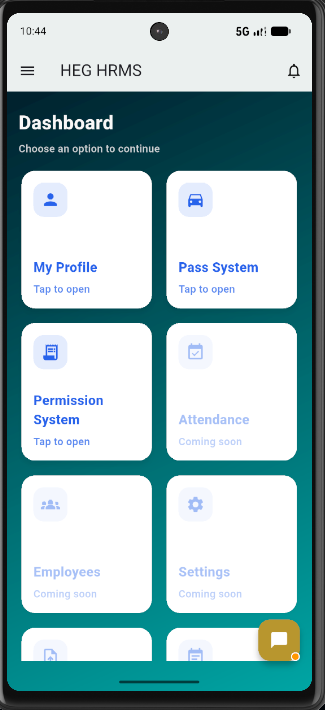
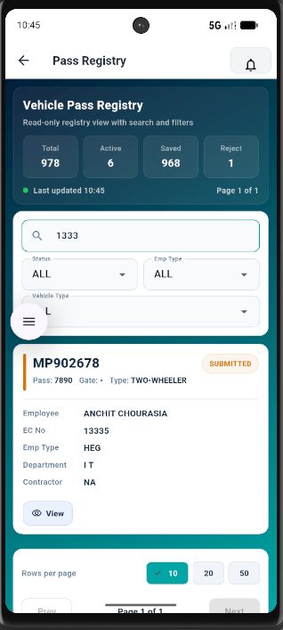

<div align="center">

# HEG HRMS Mobile Application

### Flutter-based HRMS, Vehicle Pass, and Operational Workflow Platform

[](https://flutter.dev)
[](https://dart.dev)
[](#supported-platforms)
[](#project-status)

A mobile-first workspace for HR operations, vehicle-pass workflows, permissions, documents, approvals, and gate-related activities.

</div>

---

## Overview

**HEG HRMS Mobile Application** is a Flutter project that consolidates operational workflows into a clear, role-oriented mobile experience. It provides a foundation for employees, contractors, security teams, and approvers to work with vehicle passes, supporting documents, employee data, notifications, and related HRMS processes.

The project follows a modular Flutter structure with dedicated layers for data access, models, services, feature screens, and reusable UI components. Runtime infrastructure details are intentionally excluded from this public repository.

## Product Preview

<table>
  <tr>
    <td align="center" width="50%">
      <strong>Mobile Dashboard</strong><br/><br/>
      
    </td>
    <td align="center" width="50%">
      <strong>Vehicle Pass Registry</strong><br/><br/>
      
    </td>
  </tr>
</table>

> Screenshots are included for product demonstration. Public-facing examples should use approved, sanitized demo data only.

## Key Capabilities

<table>
  <tr>
    <td width="50%" valign="top">
      <h3>📱 HRMS Dashboard</h3>
      <ul>
        <li>Mobile navigation hub for core HRMS workflows</li>
        <li>Profile, pass, and permission system entry points</li>
        <li>Clear placeholders for modules under development</li>
        <li>Responsive, mobile-first user interface</li>
      </ul>
    </td>
    <td width="50%" valign="top">
      <h3>🚗 Vehicle Pass Registry</h3>
      <ul>
        <li>Search by pass, vehicle, employee, or contractor details</li>
        <li>Status, employee-type, and vehicle-type filters</li>
        <li>Summary cards, page-size controls, and pagination</li>
        <li>Dedicated empty-state experience for no matching results</li>
      </ul>
    </td>
  </tr>
  <tr>
    <td width="50%" valign="top">
      <h3>📝 Pass Workflow</h3>
      <ul>
        <li>Create, save, submit, edit, and read-only pass flows</li>
        <li>Vehicle, gate, parking, employee, and contractor details</li>
        <li>Document details, attachments, and download support</li>
        <li>Pass stickers for eligible workflow states</li>
      </ul>
    </td>
    <td width="50%" valign="top">
      <h3>✅ Approval and Audit</h3>
      <ul>
        <li>Workflow actions for confirmation, approval, rejection, and modification</li>
        <li>Status visibility and pass-history presentation</li>
        <li>Employee and contractor lookup with validation</li>
        <li>Foundations for permissions, CVPS, insurance, and notifications</li>
      </ul>
    </td>
  </tr>
</table>

## Workflow Lifecycle

```text
SAVED
  │
  ├── Submit ──> SUBMITTED ──> CONFIRMED ──> ACTIVE
  │                              │
  │                              ├── Reject ──> REJECT
  │                              │
  │                              └── Request Changes ──> MODIFY / NEEDS_MODIFICATION
  │                                                               │
  └───────────────────────────────────────────────────────────────┘
                         Save, update, and resubmit
```

The registry is designed around auditability: workflow state changes preserve the record rather than relying on destructive deletion.

## Application Modules

| Module | Scope |
| --- | --- |
| Dashboard | Role-oriented navigation to available HRMS functions |
| Authentication | Login and session-oriented application entry |
| Profile | Employee-focused profile experience |
| Vehicle Pass Registry | Search, filters, summaries, pagination, pass review |
| Pass Entry | Vehicle, employee/contractor, gate, parking, and document capture |
| Approval Workflow | Confirmation, approval, rejection, modification, and history flows |
| Permission System | Permission and CVPS-related workflows |
| Insurance | Upload and detail/review screens |
| Notifications | Notification-view foundation |
| Attendance, Employees, Settings | Planned or actively evolving modules |

## Architecture

```text
HEG/
├── lib/
│   ├── core/        Application bootstrap and configuration abstractions
│   ├── data/        API clients and data-access layer
│   ├── models/      Domain, request, and response models
│   ├── screens/     Feature screens and workflow pages
│   ├── services/    Shared application services
│   └── widgets/     Reusable visual components
├── assets/          Packaged application assets
├── android/         Android platform target
├── ios/             iOS platform target
├── web/             Web platform target
├── windows/         Windows platform target
├── macos/           macOS platform target
├── linux/           Linux platform target
└── pubspec.yaml     Dependencies and application metadata
```

## Technology Stack

| Category | Technology |
| --- | --- |
| Mobile framework | Flutter and Dart |
| HTTP integration | `http` |
| Local persistence | `shared_preferences`, `sqflite`, `hive`, `hive_flutter` |
| Documents and files | `file_picker`, `open_filex`, `share_plus` |
| PDF support | `pdf`, `printing` |
| Connectivity and messaging | `connectivity_plus`, `stomp_dart_client` |
| Environment support | `flutter_dotenv` |
| Code quality | `flutter_lints` |
| Delivery approach | Jenkins-based CI/CD |

## Getting Started

### Prerequisites

- Flutter SDK compatible with the SDK constraint in `HEG/pubspec.yaml`
- Android Studio or Visual Studio Code with Flutter and Dart extensions
- Android SDK, emulator, or physical Android device
- macOS with Xcode for iOS builds and real-device iPhone testing

### Run locally

```bash
cd HEG
flutter pub get
flutter run
```

### Build an Android APK

```bash
cd HEG
flutter build apk --release
```

### USB-connected Android device

For local backend testing with a USB-connected Android device, use an ADB reverse tunnel with your own development port:

```bash
adb reverse tcp:<PORT> tcp:<PORT>
```

This is for local development only. A shareable or release build should use an approved, secured, reachable environment endpoint.

## Security and Configuration

This is a public showcase repository. Never commit real values for:

- API keys, tokens, passwords, or certificates
- Internal IP addresses, hostnames, or production URLs
- Database credentials or connection strings
- Local environment files
- Private employee, contractor, vehicle, or pass information

Keep runtime settings in local ignored configuration files or inject them through the approved Jenkins-based deployment process. If a credential was committed previously, rotate it; removing it only from the newest commit does not remove it from historical commits.

## Project Status

| Area | Current state |
| --- | --- |
| Dashboard and navigation | Implemented and evolving |
| Vehicle Pass Registry | Implemented and evolving |
| Pass entry and review | Implemented and evolving |
| Workflow and history | Implemented and evolving |
| Permission and CVPS features | In progress |
| Attendance, employee, and settings modules | Planned / in progress |
| Production hardening and release configuration | In progress |

## Roadmap

- [ ] Complete the remaining dashboard modules
- [ ] Expand role-based approval workflows
- [ ] Enhance offline and connectivity handling
- [ ] Extend reporting and operational analytics
- [ ] Improve automated validation and quality checks
- [ ] Continue refining accessibility and mobile UX

## Supported Platforms

| Platform | Status |
| --- | --- |
| Android | Primary development and testing target |
| iOS | Project target available; requires macOS and Xcode |
| Web | Flutter project target available |
| Windows, macOS, Linux | Flutter desktop targets available |

## About This Repository

This repository is intended as a public, portfolio-friendly representation of the Flutter mobile client. It omits private backend services, internal configuration, and real environment credentials.

Before using or re-sharing any part of the project, ensure compliance with the applicable organization policies and confirm that all sample data and visuals are approved for public use.

---

<div align="center">

Built with Flutter for HRMS and vehicle-pass operations.

</div>